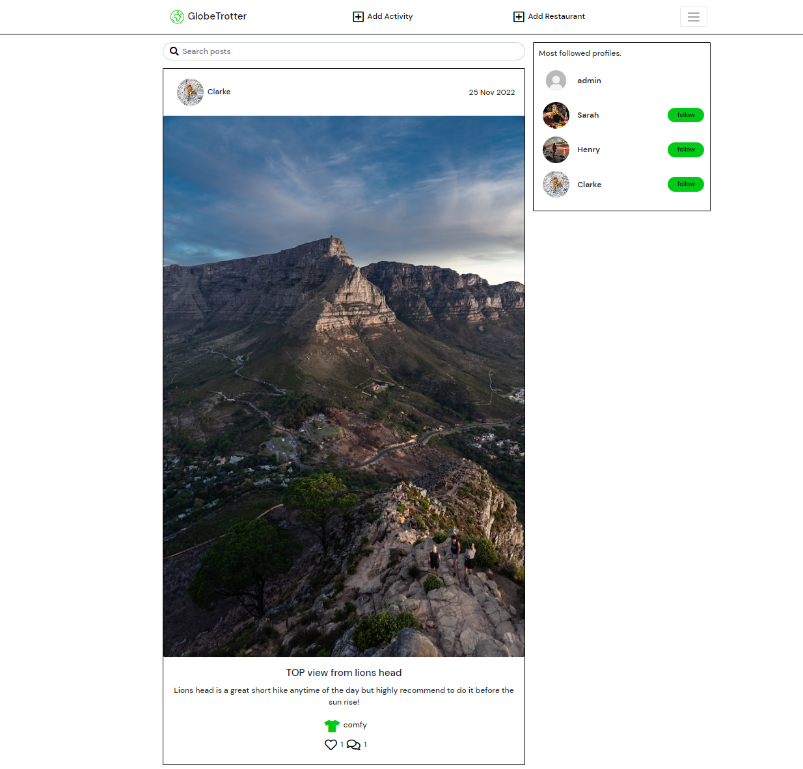
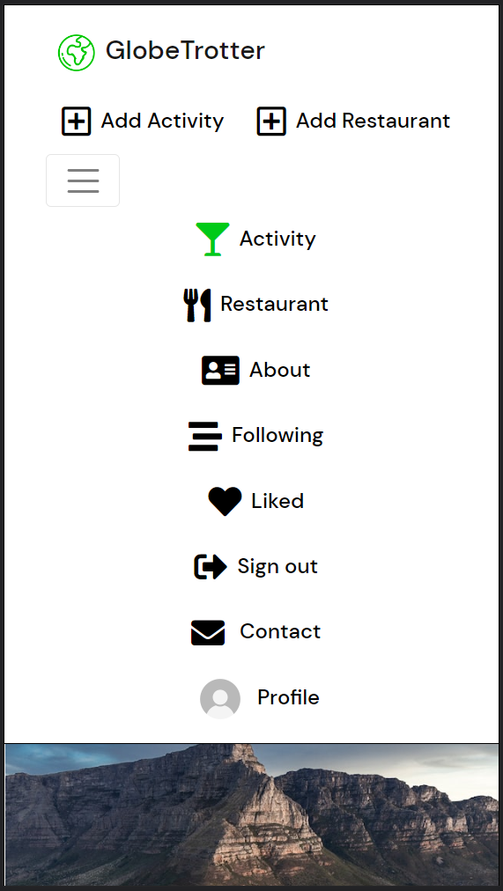
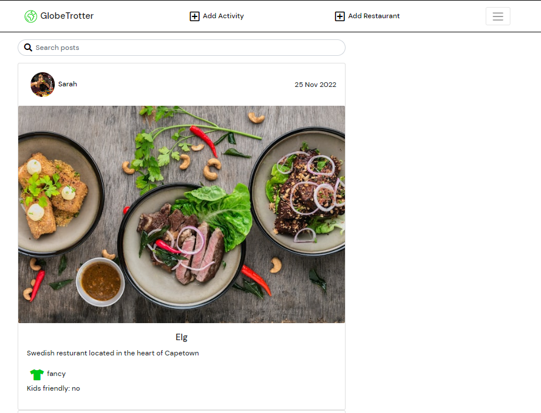
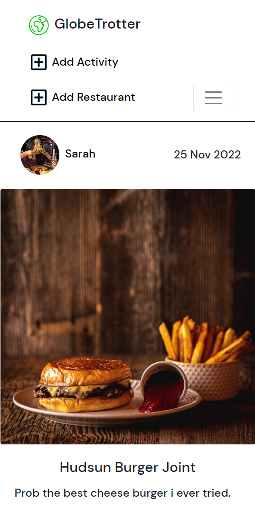
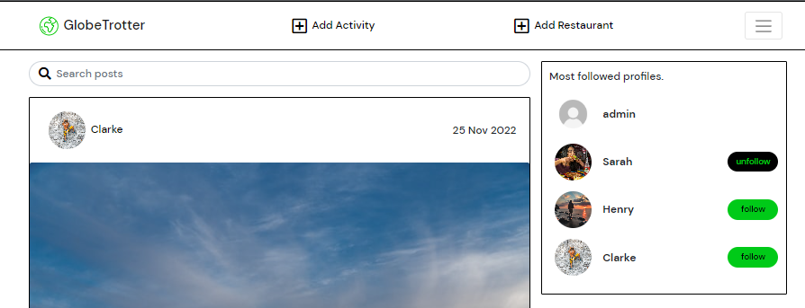
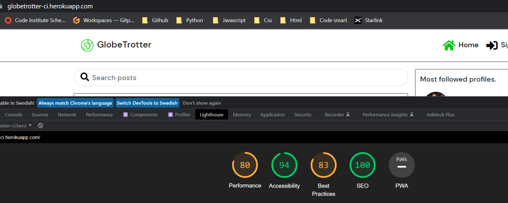

Color:
#00ca18;
Black
White

# GlobeTrotter

Globetrotter is a social media platform where users can learn more about Southafrica (Capetown) and instead of going to the usual bars/resturant and the normal turist traps its a webpage for both locals that want to try new experiances aswell as for turist that don't know someone local to tell them whats nice and not.

#### DEPLOYED API HEROKU [LINK](https://globetrotter-drf-api.herokuapp.com/)

#### DEPLOYED FRONTEND HEROKU [LINK - LIVE SITE](https://globetrotter-ci.herokuapp.com/)

#### DEPLOYED FRONTEND [REPOSITORY](https://github.com/Stuffy33/globetrotter)

#### DEPLOYED BACKEND [REPOSITORY](https://github.com/Stuffy33/globetrotter-drf-api/)


The live link for "The Red Crayon" can be found [HERE](https://red-crayon.herokuapp.com/)

## Table of Contents

- [UX](#ux "UX")
  - [Site Purpose](#site-purpose "Site Purpose")
  - [Site Goal](#site-goal "Site Goal")
  - [Audience](#audience "Audience")
  - [Current User Goals](#current-user-goals "Current User Goals")
- [User Stories](#user-stories "User Stories")
- [Design](#design "Design")
  - [Colour Scheme](#colour-scheme "Colour Scheme")
  - [Typography](#typography "Typography")
  - [Imagery](#imagery "Imagery")
- [Features](#features "Features")
  - [Existing Features](#existing-features "Existing Features")
  - [C.R.U.D](#crud "C.R.U.D")
- [Testing](#testing "Testing")
  - [Validator Testing](#validator-testing "Validator Testing")
- [Technologies Used](#technologies-used "Technologies Used")
  - [Main Languages Used](#main-languages-used "Main Languages Used")
  - [Frameworks, Libraries & Programs Used](#frameworks-libraries-programs-used "Frameworks, Libraries & Programs Used")
- [Components](#oomponents "Components")
- [Deployment](#deployment "Deployment")
- [Credits](#credits "Credits")
  - [Content](#content "Content")

## UX

### Site Purpose:

To let more people know about the golden nuggets of Capetown.

### Site Goal:

The Red Crayon is intended to keep the community informed about the ongoings in the art-world, and to share inspiration & events with each other, as well as bring people together.
GlobeTrotter is intention is to keep a comunity that gives eachother ideas of what to do in Capetown but as time goes this could also expand to different citys in Southafrica or the world

### Audience:

Everyone that wants to explore new experiances.

### Current User Goals:

To keep users coming back again & again to see what is new in terms of resturants and activites, as well as to follow up with other users that they follow which could lead to new firends that you can go out and do these activites with.

### Future Goals:

- Provide the ability for users to send private messages to either another user, or a group of users.
- To expand the so its not just for capetown south africa but also other places globaly.

## User Stories

I have included links to the [GitHub Issues](https://github.com/Stuffy33/globetrotter/issues) for this project, as well as the [KANBAN board](https://github.com/users/Stuffy33/projects/7).

Please also find a full list of the Epics, User stories, typed up (src/static/readme-userstorieis.png).

## Design

### Wireframes:

##### Home Page - Desktop:

used figma


##### Home Page with open burger menu - Mobile:

used figma


### Colour Scheme:

Green = #00ca18
Black = default black
white = #ffffff

### Typography:

All fonts were obtained from the Google Fonts library.
"DM Sans", sans-serif;

## Features

### Existing Features:

##### Navigation - Desktop:


##### Navigation - Mobile:


#### About Page:


#### Foods Page:




#### Submission Form:


#### 404 Page Not Found:


#### Popular Profiles:



#### Log in, Log out & Sign up:

##### Login:


##### Logout:


##### Sign-up:


### Features Left to Implement:

- Notifications when a user receives a new follower, comment, or like.
- Private messaging between users.
- Group messaging between users.
- Restrict profile & posts views to only an approved list of users, should a user wish.

## Testing

### Manual Testing:

1. 500 server error:

- Resolved with serializing food

2. CRUD functionality has been tested for each of the following: Posts | Foods| Comments | Likes | Follow | Profile

- Likes & Follow can be created & deleted
- Profile can be updated
- comments can be edited

3. All nav links open to the correct page.
4. Pages intended for logged-in users only will redirect logged-out users back to the home page.
5. Users can't edit or posts thats not theirs
6. Users are able to create a new account.
7. Users with an existing account are able to log in.
8. Each user has the ability to log out.
9. Owner is not allowed to like their own post gets greeted by a message.

### Validator Testing

1. CSS files pass through the [Jigsaw validator](src/static/Jigsaw%20validator.png) with no issues found.

----xxxxx OBS xxxxx -----
I contacted student care and got helped by Ger
i couldt not deploy to heroku while using ESLint so it has been uninstalled on the deployed verison.

2. a. Javascript files pass through [ESLint](https://eslint.org/). The following issues were raised, and have been intentionally ignored as they are in relation to code that was provided in the Moments Walkthrough project:

- Props spreading is forbidden
- Do not pass children as props.
- Do not use Array index in keys
- 'a_name' is already declared in the upper scope
- Expected an assignment or function call and instead saw an expression
- Do not nest ternary expressions
- Fragments should contain more than one child

2. c. All instances of errors where a newline has been asked for within an opening & closing set of tags, eg:

- This particular rule does not lend to the readability of the code, & instead hinders it (in my opinion).

2. d. All `console.log(err);` have been left in place & commented out, as it was suggested
3. e. Added all files affected by the above, unresolved warnings to `.eslintignore`, as well as added the following line to the top of each individual file, `/* eslint-disable */` to allow for a successful deployment on Heroku.

4. The page has an good Accessibility rating in Lighthouse:
   performace is lacking due to images.



4. Tested the site opens in edge, Chrome, firefox without issues.

## Technologies Used

### Main Languages Used

- HTML5
- CSS3
- Javascript
- Python
- SQL - Postgres => ElephantSQL

### Frameworks, Libraries & Programs Used

- Google Fonts : For the site fonts.
- Font Awesome : To add icons navigation sections.
- GitPod : To build the project & create the JSX & CSS files before pushing the project to Github.
- GitHub : To store my repository for submission.
- figma : Was used to create mockups of the project prior to starting.
- Am I Responsive? : To ensure the project looked good across all devices.
- Favicon : To provide the code & image for the icon in the tab bar.
- Django : Used to build the backend database that serves as an API for the front-end project.
- React-Bootstrap : The styling library that has aided to the layout of the site, and which was introduced to us during the course of the program.
- DrawSQL : An interactive tool that allows for the creation of Database mock-ups so that we can visualise the relationships between models.
- ReactJS : To build the components that would collectively form the front-end application.

## Components

Several components have been implemented within this project that have been reused throughout the project:

1. axiosDefault.js : for ease of communication with the backend API.
2. Asset.js : to supply the loading spinner & user avatar throughout the site.
3. DropdownMenu.js : to allow users to edit/delete their Foods & Posts.
4. CurrentUserContext.js : confirm users logged-in status to determine what functionality is available to that user.
5. ProfileDataContext.js : provide un/follow ability to other users across PopProf & ProfPage components.
6. ToggleCollapse.js : for dropdown menu (burger)
7. useRedirect.js : redirects a user to another page if they are not authorised to be on the page they are trying to access.
8. utils.js : supplies functionality to all of the components that utilise the Infinite Scroll.

## Deployment

The site was deployed to Heroku. The steps to deploy are as follows:

1. Launch the gitpod workspace.
2. Install ReactJS:

```
npx create-react-app . --use-npm
npm start
```

2. Install the following packages using the command `npm install`:

```
react-bootstrap@1.6.3 bootstrap@4.6.0
react-router-dom@5.3.0
axios
react-infinite-scroll-component
msw --save-dev
jwt-decode
-g eslint
```

3. Git add, commit, and push changes to gitpod.
4. Create the project app on Heroku, and link the GitHub repository by navigating to the 'Deploy' tab.

### Connecting to the API:

1. Navigated to the Heroku app of the project DRF-API, and under the Settings tab, added the following configvars:

- Key: CLIENT_ORIGIN | Value: https://react-app-name.herokuapp.com
- Key: CLIENT_ORIGIN_DEV | Value: https://gitpod-browser-link.ws-eu54.gitpod.io

2. Check that the trailing slash `\` at the end of both links has been removed, and save the configvar pairs.
3. Install the Axios package, & create supporting `axiosDefaults.js` as shown in [Moments Walkthrough](https://github.com/Code-Institute-Solutions/moments/blob/cf955d2f2e6f70f61c92d1f9de85558d8e49f3a8/src/api/axiosDefaults.js).

### Deploy to Heroku:

1. In the `scripts` section of `package.json` in gitpod, added the following command:

```
"heroku-prebuild": "npm install -g serve",
```

2. Add Procfile to project root & populate with the following:

```
web: serve -s build
```

3. Repeat the steps of git add/commit/push.
4. Deploy the project via the deploy button on Heroku.

## Credits

### Content

- Code Institute: Moment walkthrough project was extremely helpfull to go back and refresh ideas
- [Duncan]helps me to troubleshoot when needed, supports me
- [Darkpuppy] someone to bounce ideas off
- [Lauren] Readme template
- [Martina Terlevic](https://github.com/SephTheOverwitch): A support system, providing reassurance.
